<p align="center">
  
</p>

<p align="center">
  <a href="https://github.com/ayushtripathi-45/Feastify"></a>
  <a href="https://github.com/ayushtripathi-45/Feastify"></a>
  <a href="https://github.com/ayushtripathi-45/Feastify"></a>
  <a href="https://github.com/ayushtripathi-45/Feastify"></a>
  
  
  
</p>

<p align="center">
  <b>A modern, animated front-end food delivery experience featuring dedicated <span style="color:#E23744">Zomato</span> & <span style="color:#FC8019">Swiggy</span> reference pages.</b>
</p>

---

## ✨ Overview

**Feastify** is a sleek, fully responsive food delivery platform UI built with vanilla HTML, CSS, and JavaScript. It showcases beautifully crafted dish cards, a premium browsing experience, and two dedicated brand reference pages — **Zomato** and **Swiggy** — each presenting curated categories with a *View All* redirect to the real platforms.

> The hero banner above is an **animated SVG** — colors shift and the logo gently floats to give the README a lively, professional feel.

---

## 🚀 Features

- 🍔 **6 food categories** — Burgers, Pizza, Pasta, Healthy, Drinks & Desserts.
- 📄 **Dedicated brand pages** — `zomato.html` & `swiggy.html`, each themed in the brand's signature color.
- 🔗 **"View All" redirects** — every category links out to the real [zomato.com](https://www.zomato.com) / [swiggy.com](https://www.swiggy.com) in a new tab.
- 🎬 **Cool entrance animations** — staggered fade-up reveals on page load.
- 🦶 **Rich, visible footer** — multi-column navigation, social links and brand CTAs.
- 📱 **Fully responsive** — fluid grids that adapt from desktop to mobile.
- 🧊 **Glassmorphism UI** — blurred cards, glows and animated blobs.
- 🛒 **Cart & loader** — shared components reused across pages.

---

## 🍕 Zomato & Swiggy Pages

| Page | Theme Color | Items / Category | Action |
|------|-------------|------------------|--------|
| `html/zomato.html` | Red `#E23744` | 4 | Redirects to zomato.com |
| `html/swiggy.html` | Orange `#FC8019` | 4 | Redirects to swiggy.com |

Each page lists **4 dishes per category** (24 dishes total) and a **View All** link on every category section that opens the live platform.

---

## 🛠️ Tech Stack

| Layer | Technology |
|-------|------------|
| Markup | HTML5 |
| Styling | CSS3 (Flexbox, Grid, Custom Properties, Keyframes) |
| Interactivity | Vanilla JavaScript |
| Assets | SVG icons, custom food imagery |
| Fonts | Sora & Outfit (Google Fonts) |

---

## 📁 Project Structure

```text
Feastify/
├── assets/
│   ├── images/            # Food & UI imagery
│   └── readme-banner.svg  # Animated README banner
├── css/
│   ├── style.css
│   ├── popular.css
│   ├── menu.css
│   ├── brand.css          # Zomato/Swiggy themes, animations, footer
│   ├── responsive.css
│   └── loader.css
├── html/
│   ├── index.html         # Landing page
│   ├── menu.html
│   ├── popular.html
│   ├── restaurants.html
│   ├── offers.html
│   ├── cart.html
│   ├── contact.html
│   ├── login.html
│   ├── zomato.html        # ★ NEW
│   └── swiggy.html        # ★ NEW
├── js/
│   ├── cart.js
│   ├── loader.js
│   └── ...                # page-specific scripts
└── README.md
```

---

## 🏁 Getting Started

No build step required — it's a static site.

```bash
# Clone the repository
git clone https://github.com/ayushtripathi-45/Feastify.git

# Open the site
cd Feastify
# Just open index.html in your browser, or use a live server:
python -m http.server 5500
# then visit http://localhost:5500/html/index.html
```

> Tip: Use a local server (e.g. VS Code *Live Server*) so relative asset paths resolve cleanly.

---

## 🗺️ Future Increments & Enhancements

Planned improvements to take Feastify to the next level:

- [ ] **Live API integration** with Zomato / Swiggy for real menus, prices & availability.
- [ ] **Search & smart filters** (price, rating, veg/non-veg, delivery time) on every page.
- [ ] **Persistent cart** using `localStorage` with quantity steppers and totals.
- [ ] **User accounts** — login, saved addresses and order history.
- [ ] **Real-time order tracking** with an animated map and status timeline.
- [ ] **Wishlist & favorites** synced across sessions.
- [ ] **Dark / Light theme toggle** with preference memory.
- [ ] **Lazy-loaded images** & modern `<picture>` sources for faster loads.
- [ ] **PWA support** — installable, offline-capable app shell.
- [ ] **Accessibility pass** — ARIA roles, keyboard nav and reduced-motion support.
- [ ] **i18n / multi-language** support for wider reach.
- [ ] **Framework migration** (React / Vue) with component-based architecture.
- [ ] **Animations upgrade** — scroll-triggered reveals via IntersectionObserver.
- [ ] **Testimonials & ratings** carousel on the landing page.

---

## 🤝 Contributing

Contributions are welcome!

1. Fork the repo.
2. Create a feature branch: `git checkout -b feature/my-idea`.
3. Commit your changes: `git commit -m "Add awesome feature"`.
4. Push: `git push origin feature/my-idea`.
5. Open a Pull Request. 🎉

---

## 📄 License

Distributed for learning and demonstration purposes. See the repository for details.

<p align="center">
  <sub>Made with ❤ by the Feastify community · ⭐ the repo if you like it!</sub>
</p>
